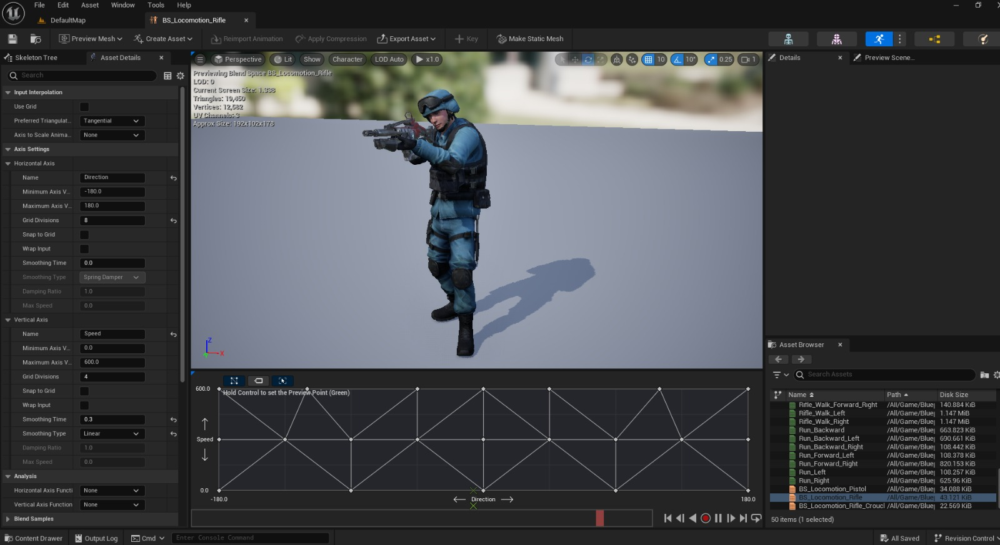

# Unreal Engine 5 Movement

# Movement Mechanics in [Your Project Name]

## Overview
In this section, I will describe the movement mechanics I've implemented in [Mercenary]. The focus has been on creating a fluid and responsive 8-way locomotion system via animations from Mixamo.
## Takeaways
-I seperated Controls from Character class every input action defined in PlayerController class
-I used enhanced input system
-I implemented simple GAS(GameplayAbilitySystem) Collectibles and FireArea
-I simply implemented Model View Controller Architecture(MVC) for user interface - Just Progress bar for now
-This work focused on movement and how can it be better with limited assets consisted.

## Conclusion
This document summarizes the key aspects of the movement mechanics I’ve developed in [Your Project Name]. I am excited to continue improving this system and exploring new features that can enhance gameplay.

![Preview how is Animation Blueprint set]Animation Blueprint.jpeg)
